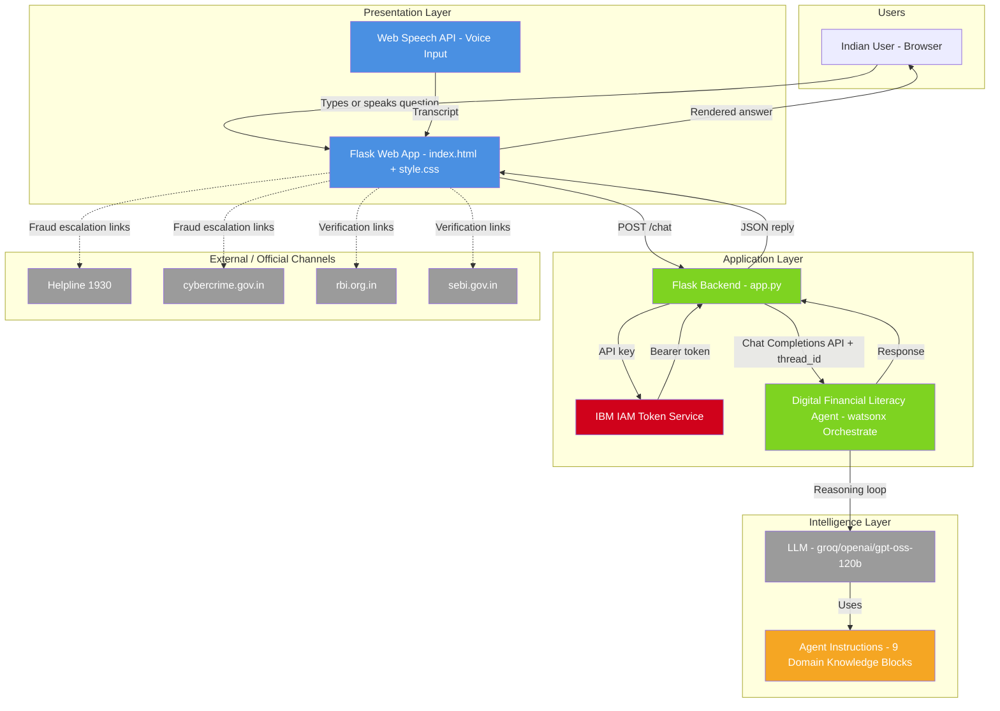
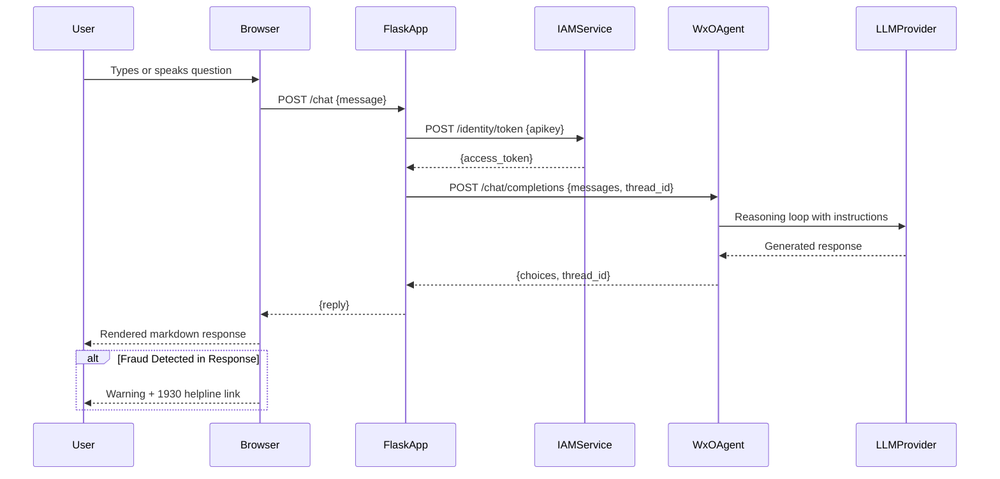

# Digital Financial Literacy Agent — Solution Architecture

**Document Type**: Solution Architecture
**Version**: 1.0
**Date**: 2025
**Status**: Draft
**Related Documents**:
- [digital-financial-literacy-overview.md](digital-financial-literacy-overview.md) (Business Overview)
- [digital-financial-literacy-implementation.md](digital-financial-literacy-implementation.md) (Implementation Plan)

---

## 1. Architecture Overview

Refer to the [Solution Overview document](digital-financial-literacy-overview.md) for business context, problem statement, and capability descriptions.

The solution is a single-agent conversational AI system built on IBM watsonx Orchestrate. The agent uses the `react_core` reasoning style, which gives it the ability to reason step-by-step before responding — critical for tasks like scam analysis, FD maturity calculations, and EMI computation. All domain knowledge (FD rates, tax rules, scam patterns, regulatory references) is embedded directly in the agent's instruction set, eliminating the need for external tool calls for the current scope.

The web interface is a Flask application that mediates between the browser and the watsonx Orchestrate Chat Completions API. Session continuity is maintained via thread IDs stored in the Flask server-side session. Voice input is handled entirely client-side using the browser's Web Speech API, with no server-side audio processing required.

---

## 2. Solution Architecture Diagram

**Legend**:
- Blue: User-facing presentation (browser UI, voice)
- Green: Application logic (Flask, watsonx Orchestrate agent)
- Orange: Embedded knowledge / instruction store
- Red: Security / authentication
- Gray: External systems and official channels

---

## 3. Component Breakdown

### Component 1: Flask Web Application (`app.py`)

**Purpose**: Serves the chat UI and acts as the secure intermediary between the browser and watsonx Orchestrate, handling IAM token exchange and session management.

**Key Responsibilities**:
- Serve `index.html` at the root route (`GET /`)
- Accept user messages via `POST /chat` and forward to watsonx Orchestrate
- Exchange the IBM API key for a short-lived IAM Bearer token on each request
- Maintain conversation thread continuity using Flask server-side session (`thread_id`)
- Handle `POST /reset` to clear conversation thread and start fresh
- Parse multiple watsonx Orchestrate response shapes robustly (`extract_reply_text`)

**Inputs/Outputs**: Receives JSON `{message}` from browser; returns JSON `{reply}` or `{error}`. See Integration Architecture (Section 4) for API details.

**Key Technologies**: Python, Flask 3.x, `requests`, `python-dotenv`

**Dependencies**: IBM IAM token endpoint, watsonx Orchestrate Chat Completions API, `.env` configuration

---

### Component 2: Chat UI (`templates/index.html` + `static/style.css`)

**Purpose**: Provides the full browser-based chat experience including message rendering, voice input, dark mode, suggestion chips, and mobile-responsive layout.

**Key Responsibilities**:
- Render user and assistant messages with markdown support (bold, italic, lists, inline code)
- Provide voice input via Web Speech API (language: `en-IN`; interim transcript display)
- Display suggestion chips for common queries (FD comparison, stocks, crypto, UPI, fraud)
- Support dark/light mode with localStorage persistence
- Show typing indicator while awaiting response
- Mobile sidebar with 9-capability navigation panel

**Inputs/Outputs**: POSTs `{message}` to `/chat`; renders `{reply}` with inline markdown rendering. Voice input transcribes speech to text client-side, no server involvement.

**Key Technologies**: Vanilla JS (ES2020), CSS custom properties, Web Speech API

**Dependencies**: Flask static file serving, `/chat` and `/reset` endpoints

---

### Component 3: Digital Financial Literacy Agent (watsonx Orchestrate)

**Purpose**: The core AI reasoning engine that understands user financial queries, applies domain knowledge across 9 topic areas, detects scam patterns, and generates direct plain-language responses.

**Key Responsibilities**:
- Apply react_core reasoning loop to decompose complex queries before responding
- Execute FD maturity calculations (A = P × (1 + r/4)^(4t)) and EMI calculations
- Detect fraud signals in described messages/offers and warn proactively
- Compare financial products (FDs, mutual funds, insurance) with a direct recommendation
- Escalate fraud situations to 1930, cybercrime.gov.in, RBI, or SEBI as appropriate
- Respond in Hindi or English based on the user's input language
- Ground all rate/regulatory claims in the embedded knowledge base

**Inputs/Outputs**: Receives `messages[]` array from Chat Completions API; returns structured response with `choices[0].message.content`. Thread ID returned for session continuity.

**Key Technologies**: IBM watsonx Orchestrate, `react_core` style, LLM: `groq/openai/gpt-oss-120b`

**Dependencies**: LLM provider, agent instruction set (9 domain blocks + 6 behavioral rules)

---

### Component 4: Agent Instruction Set (Embedded Knowledge)

**Purpose**: The static domain knowledge embedded in the agent's `instructions` field — the single source of truth for all financial data, rules, and behavioral constraints the agent applies.

**Key Responsibilities**:
- Store FD rates for 7 banks (ICICI, Kotak, SBI, HDFC, Axis, Yes Bank, IndusInd) as of 2025
- Define the 6 core behavioral rules (scam detection, grounded facts, plain language, direct answers, education focus, official escalation)
- Encode tax rules for stocks, mutual funds, and crypto
- Encode PPF, NPS, SGB, REIT, insurance product facts
- Define 9 topic domain instruction blocks with response format rules

**Key Technologies**: YAML instruction block in `agents/digital_financial_literacy_agent.yaml`

**Dependencies**: None (static; updated by re-importing the YAML to watsonx Orchestrate)

---

### Component 5: IBM IAM Authentication

**Purpose**: Converts the long-lived IBM API key into a short-lived Bearer token for authenticated calls to watsonx Orchestrate.

**Key Responsibilities**:
- Accept API key from environment variable (`ORCHESTRATE_API_KEY`)
- POST to `https://iam.cloud.ibm.com/identity/token` with `grant_type=apikey`
- Return `access_token` for use in Authorization header

**Key Technologies**: IBM IAM, `requests` HTTP client

**Dependencies**: Valid IBM Cloud API key, network access to `iam.cloud.ibm.com`

---

## 4. Integration Architecture

### 4.1 Integration Points

**Integration 1: IBM IAM Token Service**

- **Purpose**: Authenticate Flask backend to IBM Cloud services
- **Integration Type**: Real-time synchronous API call per user message
- **Data Exchanged**:
  - To IAM: `grant_type=urn:ibm:params:oauth:grant-type:apikey&apikey={API_KEY}`
  - From IAM: `access_token` (Bearer JWT, short-lived)
- **Integration Pattern**: Request/Response (HTTP POST, form-encoded)
- **Security**: API key stored in `.env`, never exposed to browser

---

**Integration 2: watsonx Orchestrate Chat Completions API**

- **Purpose**: Send user messages to the AI agent and receive responses
- **Integration Type**: Real-time synchronous API call
- **Endpoint**: `{ORCHESTRATE_URL}/v1/orchestrate/{AGENT_ID}/chat/completions`
- **Data Exchanged**:
  - To API: `{messages: [{role: "user", content: text}], thread_id?, stream: false}`
  - From API: `{choices: [{message: {content: string}}], thread_id}`
- **Integration Pattern**: Request/Response (REST, JSON)
- **Security**: Bearer token from IAM; Agent ID and URL from `.env`

---

**Integration 3: Web Speech API (Client-Side)**

- **Purpose**: Convert user's spoken voice to text for the chat input
- **Integration Type**: Browser-native API, no server involvement
- **Data Exchanged**:
  - Input: Microphone audio stream
  - Output: Interim and final transcript strings injected into textarea
- **Integration Pattern**: Event-driven (SpeechRecognition events: `start`, `result`, `end`, `error`)
- **Security**: Browser microphone permission prompt; no audio data leaves the device

---

### 4.2 Data Flow Diagram

---

## 5. Data Architecture

### 5.1 Data Entities

**Entity 1: User Message**
- **Description**: A single conversational turn submitted by the user
- **Key Attributes**:
  - `message`: User's question text (string, max 2000 chars)
  - `role`: Always `"user"` (string)
  - `thread_id`: Session identifier (UUID, optional)
- **Data Source**: Browser textarea or Web Speech API transcript
- **Privacy Classification**: Confidential (may contain personal financial details)

---

**Entity 2: Agent Response**
- **Description**: The AI-generated reply returned by watsonx Orchestrate
- **Key Attributes**:
  - `content`: Response text (string, markdown-formatted)
  - `role`: Always `"assistant"` (string)
  - `thread_id`: Session identifier for conversation continuity (UUID)
- **Data Source**: watsonx Orchestrate / LLM
- **Privacy Classification**: Internal (financial education content, no user PII)

---

**Entity 3: Conversation Thread**
- **Description**: A logical grouping of messages in a single user session
- **Key Attributes**:
  - `thread_id`: Unique session identifier (UUID)
  - Stored in Flask server-side session (in-memory, not persisted to disk)
- **Data Source**: watsonx Orchestrate (assigned on first message)
- **Privacy Classification**: Internal
- **Lifecycle**: Cleared on `POST /reset` or session expiry

---

**Entity 4: Agent Configuration**
- **Description**: The YAML definition of the agent's identity, LLM, style, and instructions
- **Key Attributes**:
  - `name`, `description`, `llm`, `style`, `instructions`, `tags`
  - File: `agents/digital_financial_literacy_agent.yaml`
- **Data Source**: Developer-authored; imported to watsonx Orchestrate via CLI
- **Privacy Classification**: Internal (contains embedded rate data and behavioral rules)

---

### 5.2 Data Storage Strategy

**Primary Session Store**: Flask in-memory session (server-side)
- **Type**: In-memory key-value (Python dict via Flask session)
- **Purpose**: Store `thread_id` per user session for conversation continuity
- **Rationale**: No persistent user data is needed; conversation context is managed by watsonx Orchestrate thread mechanism

**No persistent database** is used in the current architecture. No user messages, personal data, or conversation history are stored to disk. This simplifies compliance posture significantly.

**Configuration Store**: `.env` file
- Stores `ORCHESTRATE_API_KEY`, `ORCHESTRATE_URL`, `ORCHESTRATE_AGENT_ID`, `FLASK_SECRET_KEY`
- Must not be committed to version control (add to `.gitignore`)

---

## 6. Security Architecture

### 6.1 Security Requirements

**Authentication**:
- IBM API key authenticates the Flask backend to IBM Cloud (server-side only)
- IAM Bearer tokens are short-lived and regenerated per request
- Flask secret key signs session cookies for `thread_id` protection

**Authorization**:
- No user authentication in the current scope (public-facing educational tool)
- All sensitive credentials (API key, agent ID) are server-side environment variables only

**Data Protection**:
- API key never transmitted to or accessible from the browser
- No PII stored persistently; all conversation data is ephemeral (in-memory session)
- HTTPS recommended for production deployment (not enforced by Flask in dev mode)

**Compliance**:
- No explicit regulatory constraints stated in requirements
- No PII storage minimises PDPA/data protection obligations

---

### 6.2 Key Security Controls

**Control 1: Server-Side API Key Storage**
- **Purpose**: Prevent exposure of IBM Cloud credentials to end users
- **Implementation**: `.env` file loaded by `python-dotenv`; key only used in Flask server process

**Control 2: IAM Token-Based Authentication**
- **Purpose**: Ensure only the authorised Flask app can call the watsonx Orchestrate agent
- **Implementation**: API key exchanged for short-lived Bearer token per request via `get_iam_token()`

**Control 3: Input Length Limiting**
- **Purpose**: Prevent prompt injection and oversized payloads
- **Implementation**: `maxlength="2000"` enforced on textarea in browser UI

**Control 4: Session Cookie Signing**
- **Purpose**: Prevent thread ID tampering between user sessions
- **Implementation**: Flask `secret_key` signs session cookie; must be set to a strong random value in production

**Control 5: Error Message Sanitisation**
- **Purpose**: Prevent internal API details leaking to users
- **Implementation**: `app.logger.error()` logs full details server-side; browser only receives generic error codes

---

## 7. Non-Functional Requirements

### 7.1 Performance Requirements

**Response Time**:
- User question to displayed answer: < 10 seconds (95th percentile; dependent on LLM latency)
- IAM token fetch: < 1 second
- Page initial load: < 2 seconds

**Throughput**:
- Designed for small-to-medium concurrent user load (educational/demo tool)
- No explicit throughput SLA stated in requirements

### 7.2 Availability Requirements

**Uptime Target**: Dependent on IBM watsonx Orchestrate SLA (not specified in requirements)

**Disaster Recovery**:
- RTO: Restart Flask process (< 5 minutes)
- RPO: No data loss risk — no persistent storage used
- Conversation context is lost on server restart (by design; sessions are ephemeral)

### 7.3 Scalability Requirements

**Current Scope**: Single Flask process, single agent instance

**Growth Path**:
- Flask can be scaled horizontally behind a load balancer (sessions must be externalised to Redis if multi-instance)
- Agent instruction updates (rate changes, new topics) require only a YAML re-import to watsonx Orchestrate — no code changes needed
- New topic domains can be added as additional instruction sections without architectural changes
